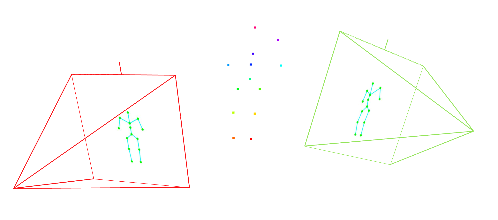

# Zeroshot Skel Viz

A Python pipeline for computing and visualizing 3D epipolar geometry, keypoint correspondences, and relative camera poses directly from 2D images. 



## Overview

Given two images representing different views of a scene with 2D keypoints (e.g., green dots), this tool automatically:

1. **Detects Keypoints:** Robustly extracts 2D sub-pixel coordinates of the points in both images, handling anti-aliasing and artifacts via HSV color thresholding.
2. **Computes Epipolar Geometry:** Calculates the Fundamental Matrix ($F$) using camera intrinsics and extrinsics.
3. **Draws Epipolar Lines:** Casts the points from the source image as color-coded epipolar lines stretching across the target image to easily verify the 2D-to-3D projection math.
4. **Establishes Correspondences:** Automatically matches 2D points between the two images by finding points that lie within a pixel distance threshold of the computed epipolar lines.
5. **Estimates Camera Pose:** Uses OpenCV's RANSAC algorithm on the matched points to estimate the relative Rotation ($R$) and Translation ($t$) between the two cameras.
6. **3D Triangulation & Viser Rendering:** Calculates the exact 3D coordinates of the matched skeleton points and natively renders an interactive 3D web scene using `viser`, overlaying the source images directly onto 3D camera frustums to show exactly how the 3D points project back into 2D space.

## Installation

This project uses [`uv`](https://github.com/astral-sh/uv) for lightning-fast Python dependency management.

```bash
# Clone the repository
git clone https://github.com/yourusername/zeroshot-skel-viz.git
cd zeroshot-skel-viz

# Install dependencies and sync the environment
uv sync
```

## Usage

You can run the full pipeline on any two image views by passing their paths. By default, it will process the math, save the 2D visualization outputs, and launch an interactive 3D web viewer.

```bash
uv run python epipolar.py --img1 data/skels/12.png --img2 data/skels/14.png
```

### CLI Arguments

| Argument | Description | Default |
| :--- | :--- | :--- |
| `--img1` | **(Required)** Path to the first image (source of points) | None |
| `--img2` | **(Required)** Path to the second image (target for lines) | None |
| `--json` | Path to the `cameras.json` configuration file | `data/cameras.json` |
| `--out-dir`| Directory where 2D visualizations are saved | `output` |
| `--threshold` | Distance threshold (in pixels) for epipolar correspondence | `10.0` |
| `--use-gt-pose`| If set, triangulates 3D points using Ground Truth camera pose instead of the estimated RANSAC pose | `False` |
| `--no-3d` | If set, disables the interactive Viser 3D visualization popup | `False` |

## Output Artifacts

When you run the script, several artifacts are automatically generated:

1. **Interactive 3D Scene (`http://localhost:8080`)**: A Viser web UI where you can explore the camera frustums, see the source images floating in 3D space, and view the triangulated 3D skeleton point cloud.
2. **`output/pts_{img1}.png`**: The isolated 2D keypoints of the first image, each assigned a unique bright color.
3. **`output/epi_{img1}_to_{img2}.png`**: The second image overlaid with the corresponding epipolar lines matching the exact colors of the source points.
4. **`output/matches_{img1}_to_{img2}.png`**: A side-by-side stitch of both images showing the RANSAC matched candidate correspondences connected by light grey lines.

## Coordinate Conventions

By default, the script assumes the cameras in `cameras.json` follow the **OpenGL/Blender** coordinate convention (+Y up, -Z forward). If your camera extrinsics use the OpenCV convention (+Y down, +Z forward), you can pass `--opencv` to the CLI to automatically apply the necessary coordinate swaps.